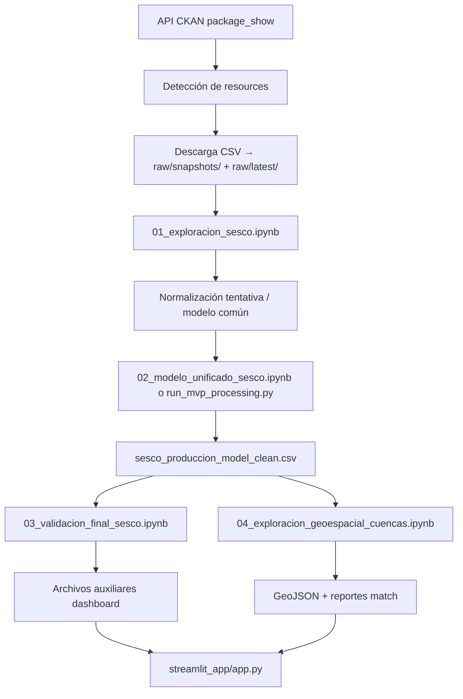

# README — exploration/

**Proyecto:** Monitor de Producción Hidrocarburífera Argentina — SESCO  
**Última revisión:** junio 2026  
**Documento principal de referencia** para la carpeta `exploration/`. Para detalle técnico de scripts o geoespacial, ver también los documentos complementarios enlazados al final.

---

## 1. Propósito de exploration/

`exploration/` es la **primera etapa real y operativa del MVP**. Concentra todo el trabajo de entender, limpiar, validar y visualizar los datos oficiales de producción hidrocarburífera antes de escalar a una arquitectura de producto más grande.

| Rol | Descripción |
|-----|-------------|
| **Qué hace** | Explora datos SESCO vía CKAN, normaliza seis recursos MVP, genera un dataset unificado, valida calidad, produce capas geoespaciales de cuencas y alimenta un dashboard Streamlit. |
| **Por qué existe** | El proyecto comenzó como exploración de datos oficiales; el volumen de trabajo creció (modelo común, validación, mapas) y esta carpeta concentra ese pipeline exploratorio reproducible. |
| **Regla metodológica** | **Primero datos, después arquitectura, después producto.** No se avanza a PostgreSQL/PostGIS, FastAPI ni frontend definitivo sin haber cerrado el entendimiento del dato. |
| **Salida inmediata** | CSV procesados + GeoJSON + `streamlit_app/app.py`. |
| **Salida futura** | Los scripts y notebooks preparan contratos de columnas, reglas de validación y artefactos que migrarán a ETL formal, PostGIS y API. |

Las carpetas `backend/` y `frontend/` del repositorio existen como base para fases posteriores, pero **no son el núcleo operativo actual**. El flujo de punta a punta que hoy funciona vive aquí.

---

## 2. Fuente principal de datos

### Dataset SESCO (producción tabular)

| Aspecto | Detalle |
|---------|---------|
| **Dataset CKAN** | `energia-produccion-petroleo-gas-sesco` |
| **Título** | Energía — Producción de petróleo y gas — SESCO |
| **Portal** | [datos.gob.ar](https://datos.gob.ar/dataset/energia-produccion-petroleo-gas-sesco) |
| **API** | `https://datos.gob.ar/api/3/action/package_show?id=energia-produccion-petroleo-gas-sesco` |

**Por qué se usa CKAN y no URLs fijas:** los recursos pueden cambiar de URL, nombre o fecha de modificación. El pipeline consulta metadata en vivo (`package_show`), resuelve el recurso por nombre o keywords y descarga desde la URL actual. El inventario local `ckan_resources.csv` complementa la auditoría humana.

### Seis recursos MVP (vistas de agregación)

| Recurso CKAN (nombre esperado) | Producto | Agrupador |
|--------------------------------|----------|-----------|
| Producción de petróleo promedio diaria por provincia | petróleo | provincia |
| Producción de gas promedio diaria por provincia | gas | provincia |
| Producción de petróleo promedio diaria por cuenca | petróleo | cuenca |
| Producción de gas promedio diaria por cuenca | gas | cuenca |
| Producción de petróleo promedio diaria por empresa | petróleo | empresa |
| Producción de gas promedio diaria por empresa | gas | empresa |

Provincia, cuenca y empresa son **vistas alternativas** del mismo fenómeno. No representan capas acumulables.

### Fuentes geoespaciales (cuencas sedimentarias)

| Archivo raw | Descripción |
|-------------|-------------|
| `data/raw/cuencas_sedimentarias_productivas.csv` | Polígonos WKT de cuencas con actividad productiva conocida (`origen_geo = productiva`). |
| `data/raw/cuencas_sedimentarias_no_productivas.csv` | Polígonos WKT de cuencas sedimentarias sin producción reportada en esa capa (`origen_geo = no_productiva`). |

Columnas esperadas: `WKT`, `cuenca`, `ubicacion`, `tipo`.

**Pozos y trayectorias:** no hay notebooks, scripts ni datasets de pozos en `exploration/` al momento de esta revisión. Ver [§13](#13-pozos-y-trayectorias-pendiente--idea-futura).

---

## 3. Estructura actual de carpetas

Árbol real inspeccionado en el repositorio (excluye `.venv/` local y contenido gitignored que cada desarrollador genera):

```
exploration/
├── README.md                              ← este documento
├── requirements.txt
├── documentacion_scripts_exploration.md   ← detalle técnico de scripts
├── documentacion_geoespacial_cuencas.md   ← cierre notebook 04 / cobertura geo
├── notebooks/
│   ├── 01_exploracion_sesco.ipynb
│   ├── 02_modelo_unificado_sesco.ipynb
│   ├── 03_validacion_final_sesco.ipynb
│   ├── 04_exploracion_geoespacial_cuencas.ipynb
│   └── _out.txt                           ← auxiliar / salida de depuración; no es parte del pipeline
├── scripts/
│   ├── inspect_ckan_resources.py
│   ├── download_sesco_resource.py
│   ├── sesco_processing.py                ← módulo central ETL
│   └── run_mvp_processing.py
├── data/
│   ├── raw/                               ← fuentes descargadas (gitignored salvo .gitkeep)
│   │   ├── snapshots/                     ← snapshots diarios versionados (YYYY-MM-DD)
│   │   │   └── YYYY-MM-DD/
│   │   │       ├── petroleo_provincia.csv
│   │   │       ├── … (6 recursos MVP)
│   │   │       └── manifest.json
│   │   ├── latest/                        ← copia de conveniencia del snapshot más reciente
│   │   └── *.csv                          ← legacy (descargas sueltas anteriores; no borrar automáticamente)
│   └── processed/                         ← derivados analíticos (gitignored salvo .gitkeep)
└── streamlit_app/
    └── app.py
```

### Notas sobre archivos especiales

| Elemento | Estado |
|----------|--------|
| `scripts/__init__.py` | **No existe.** Los notebooks agregan `scripts/` a `sys.path` e importan `sesco_processing` directamente. |
| `data/raw/*` y `data/processed/*` | **Gitignored** (`.gitignore` raíz). Cada entorno los regenera con scripts/notebooks. |
| `.venv/` | Entorno virtual local opcional; no versionado. |
| `notebooks/_out.txt` | Residuo de ejecución/debug; puede ignorarse o eliminarse. |
| `data/raw/produccion_petroleo_promedio_diaria_por_provincia_v1.csv` | Posible **legacy** / corrida anterior del mismo recurso; el pipeline MVP usa la clave `petroleo_provincia`. |
| `data/raw/snapshots/` | Snapshots versionados por fecha (`YYYY-MM-DD`); cada carpeta incluye los 6 CSV MVP + `manifest.json`. |
| `data/raw/latest/` | Copia (no symlink) del snapshot más reciente válido; el procesamiento la usa por defecto si existe. |
| `data/processed/cuencas_productivas_geo.geojson` | **Legacy** — solo 5 productivas; no usar. |
| `data/processed/cuencas_productivas_sesco_join_preview.csv` | **Legacy** — vista previa antigua; no usar. |

---

## 4. Flujo general del trabajo

Orden lógico recomendado de punta a punta:



| Etapa | Herramienta | Salida principal |
|-------|-------------|------------------|
| Inventario CKAN | `inspect_ckan_resources.py` | `ckan_resources.csv` |
| ETL 6 recursos | `run_mvp_processing.py` o notebook 02 | `*_model_clean.csv`, unificado, validaciones |
| Validación + dashboard config | Notebook 03 | `sesco_latest_periods_by_view.csv`, etc. |
| Geoespacial | Notebook 04 | `cuencas_sedimentarias_*.geojson` |
| Visualización | Streamlit | Lee processed/; no reprocesa |

**Atajo mínimo para levantar Streamlit:** `run_mvp_processing.py` → notebook 03 → (opcional) notebook 04 → `streamlit run exploration/streamlit_app/app.py`.

---

## 5. Notebooks

Ubicación: `exploration/notebooks/`. Ejecutar en orden numérico la primera vez; luego regenerar solo la etapa que cambie.

---

### 5.1 `01_exploracion_sesco.ipynb`

| Aspecto | Detalle |
|---------|---------|
| **Objetivo** | Primera exploración del dataset SESCO: validar CKAN, inspeccionar recursos y analizar en profundidad **un recurso piloto** (petróleo por provincia). |
| **Pregunta que responde** | ¿Qué publica SESCO, con qué columnas, qué calidad tiene y cómo se puede unificar? |
| **Entradas** | API CKAN; CSV descargado de petróleo por provincia en `data/raw/`. |
| **Pasos principales** | Consulta CKAN → listado de recursos → filtro por keywords → descarga CSV → inspección de columnas, nulos, rangos temporales → funciones auxiliares de inspección → normalización tentativa al modelo común → detección de período incompleto (regla 50 %) → validaciones → gráficos exploratorios → exportación de CSV procesado del recurso piloto. |
| **Salidas** | CSV procesado del recurso piloto en `data/processed/`; conclusiones metodológicas; base de funciones que migraron a `sesco_processing.py`. |
| **Decisiones metodológicas** | Definición del esquema analítico común; regla de exclusión del último mes incompleto; no sumar vistas de agregación. |
| **Relación con scripts** | Lógica extraída y centralizada en `sesco_processing.py`. `inspect_ckan_resources.py` es la versión CLI del inventario CKAN. |
| **Relación con processed** | Genera el primer `{resource_key}_model_clean.csv` de petróleo provincia; el flujo completo de 6 recursos está en la notebook 02. |
| **Relación con Streamlit** | Indirecta: define reglas y columnas que consume el dashboard. |
| **Estado** | **Completo** como exploración inicial. La sección §18 «Conclusiones» indica «completar tras ejecutar» — conviene rellenarla al cerrar una corrida local. |
| **Pendientes** | Actualizar celdas de conclusiones; parte de la lógica duplicada ya vive en el módulo (preferir importar `sesco_processing` en nuevas iteraciones). |

---

### 5.2 `02_modelo_unificado_sesco.ipynb`

| Aspecto | Detalle |
|---------|---------|
| **Objetivo** | Generalizar el procesamiento a los **6 recursos MVP** y construir el dataset unificado. |
| **Pregunta que responde** | ¿El modelo común funciona para provincia, cuenca y empresa × petróleo y gas? |
| **Entradas** | Config `SESCO_RESOURCES` (6 entradas); CKAN vía `sesco_processing`; CSV raw (descarga automática si falta). |
| **Pasos principales** | Imports + `sys.path` → listar CKAN → `sp.process_all_resources()` → `sp.export_unified()` → `sp.validate_unified_dataset()` → `sp.build_totals_comparison_table()` → gráficos exploratorios con advertencias metodológicas. |
| **Salidas** | Por recurso: `{resource_key}_model_clean.csv`, `{resource_key}_periodos_resumen.csv`. Globales: `sesco_produccion_model_clean.csv` (~33.912 filas), `sesco_validaciones_resumen.csv`. |
| **Decisiones metodológicas** | Totales nacionales solo con vista provincia; comparación entre vistas sin sumarlas; último período válido por `producto + agrupador_tipo` vía `get_valid_periods_by_group`. |
| **Relación con scripts** | Usa `sesco_processing.py` como módulo; equivalente parcial a `run_mvp_processing.py` más visualizaciones y validación unificada. |
| **Relación con Streamlit** | Genera el CSV principal que lee el dashboard. |
| **Estado** | **Completo.** |
| **Pendientes** | Config MVP duplicada con `run_mvp_processing.py` (candidata a extraer a `config.py`). |

---

### 5.3 `03_validacion_final_sesco.ipynb`

| Aspecto | Detalle |
|---------|---------|
| **Objetivo** | Validación de negocio y técnica del dataset unificado **antes del dashboard**; exportar archivos auxiliares que Streamlit no debe recalcular. |
| **Pregunta que responde** | ¿El unificado es confiable para KPIs, filtros y advertencias metodológicas? |
| **Entradas** | `sesco_produccion_model_clean.csv`; lógica inline de validación y regla del 50 % por vista. |
| **Pasos principales** | Validación de estructura → duplicados (clave lógica) → períodos por `producto + agrupador_tipo` → export `sesco_latest_periods_by_view.csv` → export `sesco_dashboard_config.csv` → producción negativa → comparación de totales entre vistas → export `sesco_totales_por_vista_resumen.csv`. |
| **Salidas** | `sesco_latest_periods_by_view.csv`, `sesco_dashboard_config.csv`, `sesco_totales_por_vista_resumen.csv`. |
| **Decisiones metodológicas** | Refuerza: no sumar provincia + cuenca + empresa; último período válido por vista; petróleo y gas separados. |
| **Relación con scripts** | **No** la ejecuta `run_mvp_processing.py`; hay que correr esta notebook (o futuro script) después del ETL. |
| **Relación con Streamlit** | `sesco_latest_periods_by_view.csv` alimenta KPIs de último período; `sesco_dashboard_config.csv` se carga pero hoy tiene **uso parcial** en la UI. |
| **Estado** | **Completo.** |
| **Pendientes** | Opcional: mover exports a un script CLI (`run_dashboard_exports.py`). |

---

### 5.4 `04_exploracion_geoespacial_cuencas.ipynb`

| Aspecto | Detalle |
|---------|---------|
| **Objetivo** | Validar capas geográficas de cuencas productivas y no productivas, consolidar geometrías, cruzar con producción SESCO por cuenca y exportar GeoJSON para mapas. |
| **Pregunta que responde** | ¿Qué cuencas SESCO tienen polígono y cómo mapear producción sobre ellas? |
| **Entradas** | `cuencas_sedimentarias_productivas.csv`, `cuencas_sedimentarias_no_productivas.csv`, `sesco_produccion_model_clean.csv`, `sesco_latest_periods_by_view.csv`. |
| **Pasos principales** | WKT → GeoDataFrame → normalización de nombres → equivalencias manuales → `consolidate_cuencas()` (productiva gana sobre no productiva) → merge SESCO → reporte de match → export GeoJSON → mapas Plotly (y Folium opcional). |
| **Salidas** | Ver [§8](#8-datos-processed) (GeoJSON y CSV de cobertura). |
| **Decisiones metodológicas** | No equivalencias silenciosas; prioridad productiva > no productiva; último período por producto desde CSV de períodos válidos. |
| **Equivalencia confirmada** | **`AUSTRAL MARINA` → `AUSTRAL`** (validada manualmente para el prototipo). Otras equivalencias (LEVALLE, BOLSONES, COLORADO, etc.) **no están confirmadas**. |
| **Relación con Streamlit** | Exporta `cuencas_sedimentarias_consolidadas.geojson` y reportes que usa la sección «Mapa por cuenca sedimentaria». |
| **Estado** | **Completo** como exploración; cobertura parcial (~59 % cuencas SESCO con geometría). |
| **Pendientes** | Validar equivalencias pendientes; ampliar capas para 7 cuencas SESCO sin polígono; limpiar observación «Pendiente AUSTRAL» en `cuencas_sesco_match_report.csv` (inconsistencia menor con validación de negocio). |

---

### 5.5 Notebooks de pozos

**No existen** en el repositorio (`05_exploracion_pozos.ipynb` o similar). Ver [§13](#13-pozos-y-trayectorias-pendiente--idea-futura).

---

## 6. Scripts

Ubicación: `exploration/scripts/`. Ejecutar desde la **raíz del repositorio** salvo que se indique lo contrario.

| Script | Estado |
|--------|--------|
| `inspect_ckan_resources.py` | Activo |
| `download_sesco_resource.py` | Activo (auxiliar) |
| `sesco_processing.py` | Activo — módulo central |
| `run_mvp_processing.py` | Activo — orquestador CLI |
| `__init__.py` | **Ausente** (paquete no formalizado) |

---

### 6.1 `inspect_ckan_resources.py`

| Campo | Detalle |
|-------|---------|
| **Responsabilidad** | Consultar CKAN y listar metadata de todos los recursos del dataset SESCO. |
| **Cuándo usarlo** | Primera vez en el proyecto; cuando falla `find_resource_by_name`; auditoría periódica de fuentes. |
| **Entradas** | API CKAN (`package_show`). |
| **Salidas** | Consola + `data/processed/ckan_resources.csv`. |
| **Funciones principales** | `fetch_package()`, listado y escritura CSV. |
| **CLI** | Sí: `python exploration/scripts/inspect_ckan_resources.py` |
| **Notebooks** | Complementa la exploración CKAN de la notebook 01. |

---

### 6.2 `download_sesco_resource.py`

| Campo | Detalle |
|-------|---------|
| **Responsabilidad** | Descarga puntual de **un** CSV por URL directa. |
| **Cuándo usarlo** | Pruebas de conectividad; recursos fuera del MVP; depuración manual. |
| **Entradas** | URL + nombre de archivo opcional. |
| **Salidas** | CSV en `data/raw/` (**sobrescribe** si existe). |
| **CLI** | `python exploration/scripts/download_sesco_resource.py "<url>" [nombre.csv]` |
| **Limitaciones** | No normaliza ni construye modelo común; no integra con `SESCO_RESOURCES_MVP`. |

---

### 6.3 `run_mvp_processing.py`

| Campo | Detalle |
|-------|---------|
| **Responsabilidad** | Orquestar el procesamiento de los 6 recursos MVP por consola. |
| **Cuándo usarlo** | Regenerar el unificado sin abrir Jupyter. |
| **Entradas** | `SESCO_RESOURCES_MVP`; CKAN + raw en `latest/` o legacy en `raw/`. |
| **Salidas** | Unificado + validaciones por recurso (ver §8). |
| **Funciones principales** | `main()` → opcional `ensure_raw_snapshot()` + `process_all_resources()` + `export_unified()`. |
| **CLI** | `python exploration/scripts/run_mvp_processing.py` |
| **CLI con snapshot** | `--update-raw` (descarga solo si CKAN cambió) · `--force-download` (fuerza descarga del día) |
| **No genera** | Archivos de la notebook 03 (`sesco_latest_periods_by_view.csv`, etc.). |

---

### 6.4 `sesco_processing.py` — módulo central

| Campo | Detalle |
|-------|---------|
| **Responsabilidad** | Pipeline ETL reutilizable: CKAN → raw → modelo común → limpieza → períodos incompletos → export → unificación. |
| **Origen** | Extraído de notebook 01 y generalizado en notebook 02. |
| **Usado por** | `run_mvp_processing.py`, notebooks 01–02 (import con `sys.path`). |
| **Estado** | Activo; candidato a migración futura a ETL PostgreSQL. |

**Capacidades principales (resumen):**

- Consulta y resolución de recursos CKAN (`fetch_ckan_package`, `find_resource_by_name`).
- Snapshots raw versionados (`ensure_raw_snapshot`, `manifest.json`, `raw/latest/`).
- Descarga condicional de CSV (`download_csv` — no re-descarga por defecto; snapshots usan `overwrite=True`).
- Normalización de columnas y detección heurística de período, producción y agrupador.
- Construcción del modelo común (`build_model_df`, `preprocess_model_df`).
- Detección de último período incompleto — regla del **50 %** (`detect_incomplete_period`, `get_valid_periods_by_group`).
- Validación por recurso y del unificado (`validate_resource_basic`, `validate_unified_dataset`).
- Exportación (`export_model_clean`, `export_period_summary`, `export_unified`).
- Orquestación (`process_resource`, `process_all_resources`).

**Detalle completo de funciones:** [documentacion_scripts_exploration.md](documentacion_scripts_exploration.md).

**Nota de mantenimiento:** CSV legacy sueltos en `data/raw/` (fuera de `snapshots/` y `latest/`) siguen siendo legibles como fallback; no se eliminan automáticamente.

### Snapshots raw y manifest

El módulo `ensure_raw_snapshot()` implementa descarga versionada desde CKAN:

| Comportamiento | Descripción |
|----------------|-------------|
| **Sin snapshots previos** | Crea `snapshots/YYYY-MM-DD/`, descarga los 6 CSV, escribe `manifest.json`, sincroniza `latest/`. |
| **CKAN sin cambios** | Reutiliza el último snapshot válido; no descarga duplicados. |
| **CKAN con cambios** | Crea snapshot del día (sufijo `_HHMMSS` si ya existe carpeta del día) y descarga los 6 recursos. |
| **`--force-download`** | Fuerza descarga aunque no haya cambios detectados. |

Ejemplo de `manifest.json`:

```json
{
  "snapshot_date": "2026-06-20",
  "created_at": "2026-06-20T14:30:00",
  "timezone_note": "created_at en hora local del sistema",
  "package_id": "energia-produccion-petroleo-gas-sesco",
  "ckan_url": "https://datos.gob.ar/api/3/action/package_show?id=energia-produccion-petroleo-gas-sesco",
  "resources": {
    "petroleo_provincia": {
      "id": "abc123",
      "name": "Producción de petróleo promedio diaria por provincia",
      "url": "https://...",
      "format": "CSV",
      "mimetype": null,
      "size": 1234567,
      "created": "2020-01-01T00:00:00",
      "last_modified": "2026-05-15T10:00:00",
      "cache_last_updated": null,
      "revision_timestamp": null,
      "hash": null
    }
  }
}
```

Los nombres de archivo en snapshots y `latest/` son `{resource_key}.csv` (ej. `petroleo_provincia.csv`).

---

### 6.5 `ProcessResult` (resumen)

`ProcessResult` es un `@dataclass` que devuelve `process_resource` por cada recurso MVP. Permite tratar los seis recursos de forma **homogénea** y acumular resultados en `process_all_resources`.

| Atributo | Qué representa |
|----------|----------------|
| `resource_key` | Clave interna (`petroleo_provincia`, `gas_cuenca`, …). |
| `config` | Dict MVP (`producto`, `agrupador_tipo`, `nombre_recurso`). |
| `df_model` | Modelo recién construido (puede tener nulos). |
| `df_model_clean` | Tras preproceso; **puede** incluir último mes incompleto. |
| `df_model_clean_valid` | Períodos válidos; **base de CSV exportados** y del unificado. |
| `period_info` | Dict con `valid_periods`, `latest_valid_period`, `excluded_period`, etc. |
| `validation` | Fila resumen para `sesco_validaciones_resumen.csv`. |
| `raw_path`, `export_path` | Trazabilidad de archivos. |
| `notes` | Notas de ejecución (descarga, exclusiones, errores). |

Documentación extendida: [§10 de documentacion_scripts_exploration.md](documentacion_scripts_exploration.md#10-estructuras-de-datos).

---

## 7. Datos raw

Ubicación: `exploration/data/raw/`. Son **datos fuente o descargados**; no deben editarse manualmente salvo reemplazo controlado de fuentes. **No se versionan** en git (solo `.gitkeep`).

| Archivo | Origen | Descripción | Usado por | Estado |
|---------|--------|-------------|-----------|--------|
| `produccion_petroleo_promedio_diaria_por_provincia.csv` | CKAN / descarga MVP | Petróleo por provincia | `sesco_processing`, notebooks | Activo |
| `produccin-de-gas-promedio-diaria-por-provincia.csv` | CKAN | Gas por provincia | idem | Activo |
| `produccin-de-petrleo-promedio-diaria-por-cuenca.csv` | CKAN | Petróleo por cuenca | idem | Activo |
| `produccin-de-gas-promedio-diaria-por-cuenca.csv` | CKAN | Gas por cuenca | idem | Activo |
| `produccin-de-petrleo-promedio-diaria-por-empresa.csv` | CKAN | Petróleo por empresa | idem | Activo |
| `produccin-de-gas-promedio-diaria-por-empresa.csv` | CKAN | Gas por empresa | idem | Activo |
| `produccion_petroleo_promedio_diaria_por_provincia_v1.csv` | Descarga anterior | Posible duplicado legacy del recurso provincia petróleo | — | **Legacy** / revisar |
| `cuencas_sedimentarias_productivas.csv` | Fuente geográfica externa | Polígonos cuencas productivas | Notebook 04 | Activo |
| `cuencas_sedimentarias_no_productivas.csv` | Fuente geográfica externa | Polígonos cuencas no productivas | Notebook 04 | Activo |

Los nombres con `produccin` / `petrleo` provienen de inferencia de URL CKAN; el pipeline resuelve por `resource_key`, no solo por nombre de archivo.

**Forzar actualización de raw SESCO:** borrar el CSV local correspondiente; `download_csv` no re-descarga si el archivo ya existe.

---

## 8. Datos processed

Ubicación: `exploration/data/processed/`. Artefactos **generados** por scripts/notebooks. No editar manualmente salvo casos puntuales documentados. **Gitignored** en el repositorio.

### 8.1 Tabular SESCO

| Archivo | Generado por | Descripción | Columnas principales | Usado por | Estado |
|---------|--------------|-------------|----------------------|-----------|--------|
| `ckan_resources.csv` | `inspect_ckan_resources.py` | Inventario CKAN | name, id, format, url, fechas | Auditoría humana | Activo |
| `petroleo_provincia_model_clean.csv` | `export_model_clean` | Petróleo × provincia | Modelo común (§9) | Unificado, análisis | Activo |
| `gas_provincia_model_clean.csv` | idem | Gas × provincia | idem | idem | Activo |
| `petroleo_cuenca_model_clean.csv` | idem | Petróleo × cuenca | idem | Mapas, unificado | Activo |
| `gas_cuenca_model_clean.csv` | idem | Gas × cuenca | idem | idem | Activo |
| `petroleo_empresa_model_clean.csv` | idem | Petróleo × empresa | idem | idem | Activo |
| `gas_empresa_model_clean.csv` | idem | Gas × empresa | idem | idem | Activo |
| `*_periodos_resumen.csv` (×6) | `export_period_summary` | Totales por período por recurso | periodo_str, totales, conteos | Control de series | Activo |
| `sesco_produccion_model_clean.csv` | `export_unified` | **Dataset unificado MVP** (~33.912 filas) | Modelo común | Streamlit, nb 03–04 | Activo |
| `sesco_validaciones_resumen.csv` | `export_unified` | Una fila de métricas por recurso | resource_key, conteos, períodos, observaciones | Notebook 03, auditoría | Activo |
| `sesco_latest_periods_by_view.csv` | Notebook 03 | Último período válido por `producto + agrupador_tipo` | producto, agrupador_tipo, latest_valid_period | Streamlit KPIs | Activo |
| `sesco_dashboard_config.csv` | Notebook 03 | Min/max período y conteo agrupadores por vista | producto, agrupador_tipo, periodo_min, latest_valid_period, cantidad_agrupadores | Streamlit (carga parcial) | Activo |
| `sesco_totales_por_vista_resumen.csv` | Notebook 03 | Comparación provincia / cuenca / empresa | pivotes y diffs vs provincia | Análisis consistencia | Activo |

### 8.2 Geoespacial

| Archivo | Generado por | Descripción | Usado por | Estado |
|---------|--------------|-------------|-----------|--------|
| `cuencas_sedimentarias_consolidadas.geojson` | Notebook 04 | 24 polígonos consolidados (sin producción) | Streamlit mapa | Activo |
| `cuencas_sedimentarias_sesco_petroleo.geojson` | Notebook 04 | Consolidado + prod. petróleo @ último período válido | Referencia / export | Activo |
| `cuencas_sedimentarias_sesco_gas.geojson` | Notebook 04 | Consolidado + prod. gas @ último período válido | Referencia / export | Activo |
| `cuencas_sesco_match_report.csv` | Notebook 04 | Match SESCO ↔ geo + filas sin producción | Streamlit (expander) | Activo |
| `cuencas_sesco_geo_coverage_summary.csv` | Notebook 04 | Resumen cobertura por producto (último período) | Streamlit (referencia estática) | Activo |
| `cuencas_productivas_geo.geojson` | Corrida anterior | Solo 5 productivas | — | **Legacy — no usar** |
| `cuencas_productivas_sesco_join_preview.csv` | Corrida anterior | Vista previa join antigua | — | **Legacy — no usar** |

---

## 9. Modelo analítico común SESCO

Esquema exportado en todos los `*_model_clean.csv` y en `sesco_produccion_model_clean.csv`. Las columnas están en **español** por contrato con notebooks y Streamlit; el código interno de `sesco_processing.py` usa nombres en inglés para funciones y variables locales.

| Columna | Significado | Ejemplo | Uso |
|---------|-------------|---------|-----|
| `periodo_str` | Período mensual canónico | `2025-11` | Filtros, ejes, joins |
| `periodo_dt` | Primer día del mes (fecha) | `2025-11-01` | Slider temporal, orden |
| `anio` | Año calendario | `2025` | Agregaciones anuales |
| `mes` | Mes (1–12) | `11` | Estacionalidad |
| `producto` | `petroleo` o `gas` | `petroleo` | Separar análisis (unidades distintas) |
| `agrupador_tipo` | `provincia`, `cuenca` o `empresa` | `cuenca` | Vista analítica |
| `agrupador_nombre` | Nombre de la entidad | `Neuquina` | Rankings, filtros, mapas |
| `tipo_recurso` | Clasificación de la serie CKAN | `promedio_diario` | Trazabilidad del tipo de publicación |
| `produccion` | Valor mensual publicado | `22097.32` | KPIs y gráficos |
| `source_resource` | Nombre oficial del recurso CKAN | `Producción de petróleo promedio diaria por provincia` | Trazabilidad |

Columnas intermedias (`periodo`, etc.) existen durante el preproceso pero **no se exportan**.

---

## 10. Reglas metodológicas

Reglas centrales del MVP. Están implementadas en `sesco_processing.py`, notebooks y Streamlit.

1. **No sumar provincia + cuenca + empresa.** Son vistas alternativas del mismo fenómeno.
2. **Totales nacionales:** usar **una sola vista**, preferentemente `agrupador_tipo = "provincia"`.
3. **Último período válido:** calcular por **`producto + agrupador_tipo`**, no con el máximo global del dataset.
4. **Períodos incompletos:** si el último período cae abruptamente (< 50 % vs penúltimo), se **excluye** de KPIs y exports válidos pero **no se borra** del dato fuente raw.
5. **Petróleo y gas:** no compararlos en el mismo eje como si tuvieran la misma unidad; usar gráficos separados o índice base 100.
6. **Nulos:** no convertir nulos a cero sin justificación; el preproceso elimina filas sin claves válidas.
7. **Trazabilidad:** mantener `source_resource` en todo el pipeline.
8. **Geoespacial:** no hacer equivalencias de nombres silenciosas; documentar equivalencias manuales. **`AUSTRAL MARINA` → `AUSTRAL` está confirmada.** Otras requieren validación explícita.
9. **Mapa:** usar geometría consolidada; advertir cobertura parcial; no presentar el mapa como cobertura nacional completa (7 cuencas SESCO siguen sin polígono).

---

## 11. Dashboard Streamlit

**Archivo:** `exploration/streamlit_app/app.py`

| Aspecto | Detalle |
|---------|---------|
| **Objetivo** | MVP de visualización local sobre CSV procesados, sin backend ni base de datos. |
| **Principio** | Capa de **visualización**; no duplica ETL ni regla del 50 %. |

### Archivos que consume

| Archivo | Uso |
|---------|-----|
| `sesco_produccion_model_clean.csv` | Dataset principal |
| `sesco_latest_periods_by_view.csv` | Último período válido por vista (KPIs) |
| `sesco_dashboard_config.csv` | Cargado al inicio; **uso limitado** en la UI actual |
| `cuencas_sedimentarias_consolidadas.geojson` | Geometría base del mapa |
| `cuencas_sesco_match_report.csv` | Tabla de match en expander |
| `cuencas_sesco_geo_coverage_summary.csv` | Referencia estática de cobertura |

### Filtros y visualizaciones

- **Sidebar:** producto, agrupador, multiselect de agrupadores, rango de períodos (slider), Top N.
- **KPIs:** último período válido, total último período, principal agrupador, variación vs período anterior, cantidad seleccionada.
- **Gráficos:** evolución mensual; ranking Top N en último período válido; evolución Top 5 (últimos 12 períodos).
- **Mapa por cuenca:** coroplético Plotly sobre geometría consolidada; producto sincronizado con sidebar; métrica total o promedio del **rango** seleccionado; tabla de control de cobertura del rango.
- **Detalle:** tabla filtrada + descarga CSV.

### Limitaciones y advertencias

- Muestra avisos metodológicos explícitos (vistas no sumables, cobertura geo parcial).
- El mapa **no** usa los GeoJSON pre-mergeados de notebook 04; recomputa producción desde el unificado + rango del slider.
- `sesco_dashboard_config.csv` podría usarse más en futuras versiones para acotar sliders por vista.
- **Streamlit no está en `requirements.txt`**; instalar aparte (ver §14).

---

## 12. Geoespacial

Resumen consolidado; detalle en [documentacion_geoespacial_cuencas.md](documentacion_geoespacial_cuencas.md).

### Capas y consolidación

| Concepto | Detalle |
|---------|---------|
| **Productiva** | Cuencas con polígono en capa de cuencas sedimentarias productivas (5 polígonos). |
| **No productiva** | Cuencas en capa ampliada sin esa clasificación productiva (19 polígonos). |
| **Consolidación** | `consolidate_cuencas()`: apila ambas; por `cuenca_join_key`, **gana productiva sobre no productiva**. |
| **Normalización** | Mayúsculas, sin tildes, espacios simples, sin prefijo genérico `CUENCA`. |

### Cobertura actual (artefactos locales)

| Métrica | Valor |
|---------|-------|
| Polígonos productivos | 5 |
| Polígonos no productivos | 19 |
| Polígonos consolidados únicos | 24 |
| Cuencas SESCO (`agrupador_tipo = cuenca`) | 17 |
| SESCO con geometría (solo productivas) | 5 (~29 %) |
| SESCO con geometría (consolidado) | **10 (~59 %)** |
| SESCO sin geometría | **7** |

**Cuencas SESCO sin geometría:** ARGENTINA NORTE, DEL COLORADO, FUERA DE CUENCA, GENERAL LEVALLE, LAS SALINAS, LOS BOLSONES, MALVINAS OESTE.

**Cuencas SESCO con geometría tras consolidar (10):** AUSTRAL (vía equivalencia), CAÑADON ASFALTO, CUYANA, GOLFO SAN JORGE, MALVINAS, MERCEDES, NEUQUINA, NORESTE, NOROESTE, ÑIRIHUAU.

### Producción mapeada (último período válido por producto)

Fuente: `cuencas_sesco_geo_coverage_summary.csv`.

| Producto | Período | Cuencas con dato | Con geometría | Sin geometría | % prod. mapeada* |
|----------|---------|------------------|---------------|---------------|------------------|
| Petróleo | 2025-11 | 8 | 7 | 1 | 100 % |
| Gas | 2026-04 | 9 | 8 | 1 | 100 % |

\*Sobre cuencas **con registro de producción en ese período**; no implica cobertura del universo completo de 17 cuencas SESCO.

### Equivalencias

| Geo | SESCO | Estado |
|-----|-------|--------|
| AUSTRAL MARINA | AUSTRAL | **Confirmada** |

Homónimos pendientes (no implementados): LEVALLE ↔ GENERAL LEVALLE, BOLSONES INTERMONTANOS ↔ LOS BOLSONES, COLORADO MARINA ↔ DEL COLORADO, ARGENTINA ↔ ARGENTINA NORTE, variantes Malvinas.

### Limitaciones

- 14 polígonos consolidados no tienen homólogo SESCO cuenca (`sin_produccion_sesco` en el reporte).
- Geometría `NORESTE` (no productivas) requirió `make_valid`.
- El mapa Streamlit es **prototipo** con cobertura parcial documentada.

---

## 13. Pozos y trayectorias (pendiente / idea futura)

**Estado actual:** no hay implementación formal en `exploration/` (sin notebooks, scripts ni datos de pozos).

Ideas documentadas para una etapa futura:

| Tema | Alcance tentativo |
|------|-------------------|
| Exploración de pozos | Coordenadas de boca, identificadores, vínculo con cuenca/provincia. |
| Trayectoria 2D | Proyección horizontal del pozo. |
| Profundidad medida (MD) | Longitud a lo largo del pozo. |
| Profundidad vertical (TVD) | Profundidad vertical verdadera. |
| Longitud horizontal (HZ) | Tramo horizontal en pozos direccionales. |
| Landing point estimado | Punto de entrada a zona objetivo. |
| Visualización 3D | Posible **simulación** a partir de MD/TVD/HZ; **no equivale** a survey direccional real sin datos oficiales de direccional. |

Próximo paso sugerido: notebook `05_exploracion_pozos.ipynb` cuando exista fuente de datos definida.

---

## 14. Cómo ejecutar

### Entorno e instalación

Desde la raíz del repositorio:

```bash
cd exploration
python -m venv .venv

# Windows
.venv\Scripts\activate

pip install -r requirements.txt

# Dashboard (no incluido en requirements.txt)
pip install streamlit
```

Dependencias principales: `pandas`, `jupyter`, `matplotlib`, `geopandas`, `shapely`, `plotly`, `folium`. La notebook 01 usa `requests`; los **scripts** usan `urllib` de la stdlib.

### Scripts

Desde la **raíz** `OilAndGas/`:

```bash
# Inventario CKAN
python exploration/scripts/inspect_ckan_resources.py

# Pipeline MVP (6 recursos → unificado)
python exploration/scripts/run_mvp_processing.py

# Actualizar raw desde CKAN solo si hay cambios, luego procesar
python exploration/scripts/run_mvp_processing.py --update-raw

# Forzar descarga raw del día, luego procesar
python exploration/scripts/run_mvp_processing.py --force-download

# Descarga puntual
python exploration/scripts/download_sesco_resource.py "https://..." nombre_opcional.csv
```

### Notebooks

```bash
cd exploration
jupyter notebook notebooks/01_exploracion_sesco.ipynb
```

En Cursor/VS Code: abrir el `.ipynb` y seleccionar el kernel de `exploration/.venv`.

**Orden recomendado:** 01 (opcional si ya se confía en el módulo) → 02 o `run_mvp_processing.py` → **03 (obligatorio para Streamlit)** → 04 (si se usa el mapa).

### Imports y `sys.path`

Los notebooks incluyen:

```python
SCRIPTS_DIR = EXPLORATION_DIR / "scripts"
sys.path.insert(0, str(SCRIPTS_DIR))
import sesco_processing as sp
```

`run_mvp_processing.py` funciona desde la raíz porque Python agrega `exploration/scripts/` a `sys.path[0]`. Alternativa:

```bash
set PYTHONPATH=exploration/scripts
python -c "import sesco_processing; print(sesco_processing.PACKAGE_ID)"
```

### Streamlit

Desde la raíz del repositorio:

```bash
streamlit run exploration/streamlit_app/app.py
```

---

## 15. Estado actual

| Componente | Estado | Observaciones |
|-----------|--------|---------------|
| Exploración SESCO (notebook 01) | Completo | Conclusiones §18 por completar en corrida local |
| Modelo unificado | Completo | ~33.912 filas; 6 recursos MVP |
| Validación final (notebook 03) | Completo | Exports auxiliares para dashboard |
| Dashboard Streamlit | MVP funcional | Mapa por cuenca integrado (prototipo) |
| Exploración geoespacial (notebook 04) | Completo | Cobertura ~59 % cuencas SESCO |
| Mapa por cuenca en Streamlit | Prototipo funcional | Rango de períodos sincronizado con sidebar |
| Pozos / trayectorias | Pendiente | Sin datos ni notebooks |
| PostgreSQL / PostGIS | Pendiente | Migración futura |
| FastAPI | Pendiente | — |
| Frontend definitivo (React + MapLibre) | Pendiente | — |

---

## 16. Qué modificar y qué no

| Necesidad | Dónde actuar |
|-----------|--------------|
| Cambiar procesamiento SESCO | `sesco_processing.py` + notebooks 01–02 + `run_mvp_processing.py` |
| Regenerar datasets tabulares | `python exploration/scripts/run_mvp_processing.py` + notebook 03 |
| Cambiar validaciones / KPIs de último período | Notebook 03 |
| Cambiar visualización Streamlit | `streamlit_app/app.py` |
| Cambiar reglas geoespaciales o equivalencias | Notebook 04 → regenerar GeoJSON y reportes |
| Auditar fuentes CKAN | `inspect_ckan_resources.py` |

**No modificar:**

- `data/processed/` manualmente (salvo depuración puntual documentada).
- `data/raw/` manualmente (salvo reemplazo controlado o borrado para forzar re-descarga).
- Archivos **legacy** geo (`cuencas_productivas_*`) como fuente del dashboard.

---

## 17. Próximos pasos recomendados

1. Completar conclusiones de la notebook 01 y alinear observaciones del match report (`AUSTRAL`).
2. Extraer `SESCO_RESOURCES_MVP` a módulo compartido (`config.py`) y agregar `scripts/__init__.py`.
3. Script CLI para exports de notebook 03 (`run_dashboard_exports.py`).
4. Validar equivalencias geo pendientes (LEVALLE, BOLSONES, COLORADO, ARGENTINA NORTE, Malvinas Oeste).
5. Ampliar capas o reglas para las **7 cuencas SESCO sin geometría**.
6. Limpiar archivos legacy geo y `_out.txt`.
7. Eliminar `print` de depuración en `process_all_resources`.
8. Añadir `streamlit` a `requirements.txt`.
9. Explorar pozos/trayectorias en nueva notebook cuando haya fuente.
10. Preparar migración ETL → PostgreSQL/PostGIS y contratos de API.

---

## 18. Enlaces a documentación complementaria

| Documento | Contenido |
|-----------|-----------|
| [documentacion_scripts_exploration.md](documentacion_scripts_exploration.md) | Detalle de cada script, funciones de `sesco_processing.py`, `ProcessResult`, reglas implementadas, archivos generados, ejecución e imports. |
| [documentacion_geoespacial_cuencas.md](documentacion_geoespacial_cuencas.md) | Cierre de notebook 04: flujo consolidado, cobertura, equivalencias, GeoJSON, limitaciones del mapa. |
| [../README.md](../README.md) | Visión general del repositorio y etapas del producto. |
| [../docs/revision_documentacion_exploration.md](../docs/revision_documentacion_exploration.md) | Auditoría de junio 2026 (parcialmente desactualizada respecto a notebook 04 y geo; usar este README como referencia principal). |

---

## Apéndice — Resumen de esta revisión documental

| Tema | Detalle |
|------|---------|
| **Archivos revisados** | Estructura `exploration/`, 4 notebooks, 4 scripts, `streamlit_app/app.py`, CSV/GeoJSON en `data/`, documentación complementaria existente. |
| **Archivo modificado** | `exploration/README.md` (reescritura integral). |
| **Notebooks documentados** | 01, 02, 03, 04 (no existe 05 pozos). |
| **Scripts documentados** | `inspect_ckan_resources.py`, `download_sesco_resource.py`, `sesco_processing.py`, `run_mvp_processing.py`. |
| **Processed principales** | `sesco_produccion_model_clean.csv`, auxiliares dashboard (03), GeoJSON/reportes geo (04). |
| **Inconsistencias detectadas** | `exploration/README.md` anterior muy desactualizado; `__init__.py` ausente; `sesco_dashboard_config.csv` cargado pero poco usado en Streamlit; observación «Pendiente AUSTRAL» en match report vs equivalencia confirmada; notebook 04 §13 aún dice equivalencia «provisoria». |
| **Próximos pasos** | Ver [§17](#17-próximos-pasos-recomendados). |
