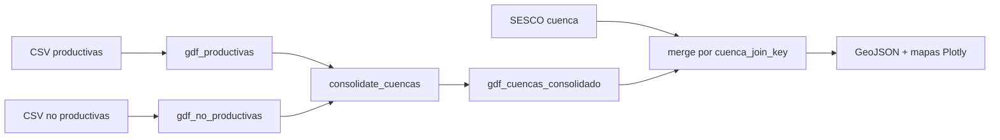

# Exploración geoespacial de cuencas sedimentarias — SESCO

Documento de cierre de la actualización de la notebook `exploration/notebooks/04_exploracion_geoespacial_cuencas.ipynb` (junio 2026).

**Alcance:** validar y consolidar capas geográficas de cuencas **productivas** y **no productivas**, cruzarlas con producción SESCO por cuenca, y dejar artefactos listos para una eventual integración en Streamlit. **No se modificó** `streamlit_app/`.

---

## 1. Objetivo de la actualización

| Aspecto | Descripción |
|--------|-------------|
| **Problema** | La capa solo **productiva** cubría 5 polígonos y emparejaban 5 de 17 cuencas SESCO; la mayoría de cuencas con dato de producción quedaban **sin geometría** en el mapa. |
| **Qué se buscó** | Incorporar `cuencas_sedimentarias_no_productivas.csv`, **consolidar** ambas capas con reglas explícitas, medir cobertura contra SESCO y exportar GeoJSON/reportes trazables. |
| **Por qué no productivas** | SESCO reporta más cuencas (p. ej. Cañadón Aspalto, Malvinas, Noreste) que no aparecen en la capa exclusivamente productiva; la capa no productiva aporta polígonos adicionales para el match por nombre normalizado. |

---

## 2. Archivos de entrada utilizados

| Archivo | Rol |
|---------|-----|
| `exploration/data/raw/cuencas_sedimentarias_productivas.csv` | Polígonos WKT de cuencas productivas (`origen_geo = productiva`). |
| `exploration/data/raw/cuencas_sedimentarias_no_productivas.csv` | Polígonos WKT de cuencas no productivas (`origen_geo = no_productiva`). |
| `exploration/data/processed/sesco_produccion_model_clean.csv` | Producción unificada; filtro `agrupador_tipo = "cuenca"`. |
| `exploration/data/processed/sesco_latest_periods_by_view.csv` | Último período **válido por producto + agrupador_tipo** (no máximo global del dataset). |

Estructura esperada de los CSV geográficos: `WKT`, `cuenca`, `ubicacion`, `tipo`.

---

## 3. Flujo aplicado en la notebook

1. **Lectura CSV** — `load_geo_csv()` con columnas obligatorias y `origen_geo` / `source_file`.
2. **WKT → geometría** — `shapely.wkt.loads`; si `is_valid` es falso se aplica `make_valid` con **aviso** (caso conocido: `NORESTE` en no productivas).
3. **CRS** — `EPSG:4326` salvo indicación contraria en la fuente.
4. **Normalización** — `normalize_cuenca_name()` (mayúsculas, sin tildes, espacios simples, sin prefijo genérico `CUENCA`).
5. **Clave de join** — `geo_join_key()` + diccionario de equivalencias manuales hacia SESCO.
6. **Consolidación** — `consolidate_cuencas(gdf_productivas, gdf_no_productivas)` → `gdf_cuencas_consolidado`.
7. **Prioridad** — por `cuenca_join_key`: **productiva** gana sobre **no_productiva**; duplicados se listan, no se eliminan en silencio.
8. **Merge SESCO** — último período por producto desde `sesco_latest_periods_by_view.csv`; petróleo y gas **por separado**.
9. **Mapas** — Plotly `choropleth_map` sobre la capa consolidada; Folium opcional.
10. **Exportación** — GeoJSON y CSV de match/cobertura en `exploration/data/processed/`.

---

## 4. Uso real de la capa no productiva

Confirmación explícita respecto del flujo actual de la notebook:

| Pregunta | Respuesta |
|----------|-----------|
| ¿Se lee `cuencas_sedimentarias_no_productivas.csv`? | **Sí** — variable `PATH_NO_PRODUCTIVAS`, sección §4, `resolve_geo_path()`. |
| ¿Se convierte a GeoDataFrame? | **Sí** — `wkt_to_geodataframe()` + `enrich_geo_attributes()` → `gdf_no_productivas`. |
| ¿Se concatena con la productiva? | **Sí** — `consolidate_cuencas()` apila ambas y deduplica por `cuenca_join_key`. |
| ¿El merge SESCO usa el consolidado? | **Sí** — `gdf_cuencas_consolidado.merge(...)` (no `gdf_productivas`). |
| ¿Los mapas usan el consolidado? | **Sí** — `gdf_petroleo` / `gdf_gas` provienen del merge sobre el consolidado. |
| ¿Queda código que use solo productivas? | **No en el flujo principal.** Solo se usan `gdf_productivas` para conteos “antes vs después” y prioridad al consolidar. |

> **Nota:** existen artefactos **legacy** de una corrida anterior (`cuencas_productivas_geo.geojson`, `cuencas_productivas_sesco_join_preview.csv`). La notebook actual exporta los archivos `cuencas_sedimentarias_*` listados abajo.

---

## 5. Resultados de cobertura

Cifras obtenidas con los artefactos procesados y la notebook en su estado actual.

### Capas geográficas

| Métrica | Cantidad |
|---------|----------|
| Cuencas **productivas** (polígonos) | 5 |
| Cuencas **no productivas** (polígonos) | 19 |
| Cuencas **consolidadas** (únicas por `cuenca_join_key`) | 24 |
| Origen en consolidado | 5 `productiva` + 19 `no_productiva` |

### Match contra SESCO (`agrupador_tipo = "cuenca"`)

| Métrica | Solo productivas | Capa consolidada |
|---------|------------------|------------------|
| Cuencas SESCO (total) | 17 | 17 |
| SESCO con geometría | 5 | **10** |
| SESCO sin geometría | 12 | **7** |
| Cobertura aproximada | 29 % | **59 %** |

**Cuencas SESCO sin geometría (7):** ARGENTINA NORTE, DEL COLORADO, FUERA DE CUENCA, GENERAL LEVALLE, LAS SALINAS, LOS BOLSONES, MALVINAS OESTE.

**Cuencas SESCO con geometría tras consolidar (10):** AUSTRAL (vía equivalencia), CAÑADON ASFALTO, CUYANA, GOLFO SAN JORGE, MALVINAS, MERCEDES, NEUQUINA, NORESTE, NOROESTE, ÑIRIHUAU.

### Producción en último período válido por producto

Períodos: **petróleo** `2025-11`, **gas** `2026-04` (desde `sesco_latest_periods_by_view.csv`).

| Producto | Cuencas con dato en período | Con geometría | Sin geometría | Producción total SESCO | Producción mapeada | % mapeada |
|----------|----------------------------|---------------|---------------|------------------------|--------------------|-----------|
| Petróleo | 8 | 7 | 1 | 134 225 | 134 225 | 100 %* |
| Gas | 9 | 8 | 1 | 140 509 | 140 509 | 100 %* |

\*El 100 % refiere a la **suma de producción de las cuencas que tienen registro en ese período**; las cuencas sin polígono no entran en el numerador del mapa. No implica cobertura espacial completa del universo SESCO.

---

## 6. Equivalencias manuales

| Geo (capa) | SESCO | Estado |
|------------|-------|--------|
| `AUSTRAL MARINA` | `AUSTRAL` | **Validada manualmente** — confirmada por negocio (no agregar equivalencias nuevas sin validación explícita) |

- Definidas en `CUENCA_EQUIVALENCIAS_GEO_A_SESCO` en la notebook.
- No se aplican merges silenciosos: figuran en `cuencas_sesco_match_report.csv` como `match_equivalencia_manual`.
- Esta equivalencia se trata como regla consolidada para el prototipo Streamlit y los GeoJSON exportados.

**Homónimos no resueltos** (posibles equivalencias futuras, no implementadas): p. ej. `LEVALLE` ↔ `GENERAL LEVALLE`, `BOLSONES INTERMONTANOS` ↔ `LOS BOLSONES`, `COLORADO MARINA` ↔ `DEL COLORADO`, `ARGENTINA` ↔ `ARGENTINA NORTE`, variantes Malvinas.

---

## 7. Archivos generados

| Archivo | Estado | Descripción |
|---------|--------|-------------|
| `cuencas_sedimentarias_consolidadas.geojson` | Generado | 24 polígonos, sin producción (capa base). |
| `cuencas_sedimentarias_sesco_petroleo.geojson` | Generado | Consolidado + producción petróleo @ 2025-11. |
| `cuencas_sedimentarias_sesco_gas.geojson` | Generado | Consolidado + producción gas @ 2026-04. |
| `cuencas_sesco_match_report.csv` | Generado | Match SESCO ↔ geo + filas `sin_produccion_sesco`. |
| `cuencas_sesco_geo_coverage_summary.csv` | Generado | Resumen de cobertura por producto. |

**Legacy (corrida anterior; no son salida del flujo consolidado actual):**

| Archivo | Nota |
|---------|------|
| `cuencas_productivas_geo.geojson` | Solo 5 productivas — **no usar** para el dashboard nuevo. |
| `cuencas_productivas_sesco_join_preview.csv` | Vista previa antigua — **no usar**. |

---

## 8. Mapas exploratorios

| Tema | Detalle |
|------|---------|
| **Plotly** | Funciona tras corregir serialización GeoJSON (excluir columnas `Timestamp` del merge, p. ej. `periodo_dt`). |
| **Color** | Escala continua por `produccion` (YlOrRd). |
| **Período** | Último válido por **producto + cuenca** (`sesco_latest_periods_by_view.csv`). |
| **Productos** | Un mapa para petróleo y otro para gas (unidades distintas, no mezcladas). |
| **Tooltip** | `cuenca`, `producto`, `periodo_str`, `produccion_txt`, `tipo`, `ubicacion`, `origen_geo`, `match_status`, `equivalencia_usada`. |
| **Folium** | Alternativa opcional si `folium` está instalado. |

**Limitaciones actuales:**

- 14 polígonos consolidados no tienen homólogo en SESCO cuenca (`sin_produccion_sesco` en el reporte).
- Cuencas sin producción en el período aparecen en el mapa con producción N/D.
- Cobertura visual ≠ cobertura nacional completa (7 cuencas SESCO siguen sin polígono).
- Prototipo Streamlit en `exploration/streamlit_app/app.py` (sección «Mapa por cuenca sedimentaria»).

---

## 9. Problemas detectados

| Tipo | Detalle |
|------|---------|
| **Sin geometría SESCO** | 7 cuencas listadas en §5. |
| **Geo sin producción SESCO** | 14 polígonos (p. ej. Argentina, Claromeco, Levalle, San Luis, etc.). |
| **Nombres** | Varias cuencas geo y SESCO no coinciden sin equivalencias adicionales. |
| **Geometría inválida** | `NORESTE` (no productivas): reparada con `make_valid` y mensaje de aviso. |
| **Cobertura** | ~59 % de cuencas SESCO con polígono; no alcanza para mapa “completo” sin más capas o reglas. |
| **Metodológica** | Prioridad productiva > no productiva asumida sin acta de negocio; homónimos pendientes fuera de AUSTRAL MARINA ↔ AUSTRAL (ya validada). |

---

## 10. Recomendación final

| Pregunta | Recomendación |
|----------|----------------|
| ¿Pasar ya a Streamlit en producción? | **No** como mapa nacional definitivo. |
| ¿Avanzar con Streamlit? | **Sí, en modo prototipo:** cargar `cuencas_sedimentarias_sesco_{petroleo\|gas}.geojson`, selector de producto, tooltip con `match_status`, tabla `cuencas_sesco_match_report.csv`, y aviso visible de cobertura incompleta. |
| ¿Seguir en exploración? | **Sí**, en paralelo al prototipo: validar equivalencias, ampliar capas o reglas para las 7 cuencas sin geometría, evaluar homónimos pendientes. |

**Antes de pasar a producción:**

1. ~~Confirmar `AUSTRAL MARINA` ↔ `AUSTRAL`~~ — **hecho** (equivalencia manual validada).
2. Decidir equivalencias para LEVALLE, BOLSONES, COLORADO, ARGENTINA NORTE, Malvinas Oeste, etc.
3. Evaluar si hace falta una capa geo adicional para las 7 cuencas SESCO faltantes.
4. Cablear en Streamlit último período por vista (mismo CSV de períodos) y **no mezclar** petróleo y gas en una sola escala.

---

## Referencias rápidas

- Notebook: `exploration/notebooks/04_exploracion_geoespacial_cuencas.ipynb`
- Dependencias geo: `exploration/requirements.txt` (`geopandas`, `shapely`, `plotly`, `folium`)
